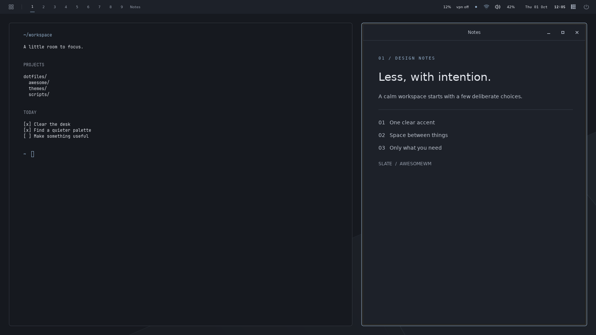

# themes

One palette, rendered into every app's config.

    themectl list | current | set <name> | next | apply | render <name>

Stowed onto PATH from scripts/.local/bin; bash and zsh complete the
subcommands, and the theme names for `set` and `render`.

- `palettes/<name>.lua` - semantic colors (bg, fg, accent, ansi.*, ...).
- `palettes/_defaults.lua` - fills in every key a palette omits, deriving
  shades with `mix(a, b, amount)`. A palette always wins over it.
- `import-omarchy <colors.toml> [name]` - writes a palette from an Omarchy
  theme (github.com/omacom/omarchy, themes/<name>/colors.toml). It carries 28
  of the 66 keys the templates ask for; the rest come from `_defaults.lua`.
  TOML, color values and template rendering are validated before publication.
  Existing palettes require `--force`; failed imports leave them intact.
- `templates/*.tpl` - app configs with `{{key}}` / `{{key|format}}` placeholders
  (formats: nohash, rgb, rgba[:aa], css[:alpha]).
- `targets.conf` - template, destination (symlinked to `out/`), reload command.
  A destination of `-` renders only.
- tmux reads its colours as `@thm_*` options from `~/.config/tmux/colors.conf`;
  the tracked `config/tmux/theme.conf` keeps the layout and ANSI fallbacks.
- GTK3 apps (PCManFM included) follow the palette through adw-gtk3
  (`adw-gtk-theme`): `gtk3-settings.ini` selects `adw-gtk3` or `adw-gtk3-dark` by
  the palette's `variant`, and `gtk3.css` recolors it with libadwaita's named
  colors, kept in step with `gtk4.css`. Stock Adwaita ignores those colors.
  GTK3 has no live reload, so open windows change on their next start.
- Qt6 apps (qBittorrent) follow it through qt6ct: the session sets
  `QT_QPA_PLATFORMTHEME=qt6ct` (`xsession/.xprofile`, Hyprland's environment),
  `qt6ct.conf` picks Fusion, GTK file dialogs and the GTK font, and
  `qt6ct-colors.conf` maps the same palette keys as `gtk3.css` onto Qt's
  palette roles. qt6ct repaints open Qt apps a few seconds after a switch.
- `hooks/*.sh` - for apps whose config themectl cannot own (herdr, rnmui, nvim,
  and the LightDM login screen).
- `out` - generated, gitignored symlink to an immutable `.generations/` directory.
  Run `themectl apply` after a fresh clone. The Waybar template is generated
  from current plugin state automatically, without changing plugin wiring.

`themectl render <name>` prints a new temporary preview directory. It never
changes live output, links, state or reloads apps. Delete the preview when done.

Switches are serialized with `flock`; fully rendered generations are activated
with one atomic symlink replacement. `current` reads the name from the active
generation. Previous generations are retained for recovery. The first switch
from a legacy `out/` directory moves it into `.generations/legacy.*`; that
one-time migration has a brief gap before its symlink is installed. Initial
destination linking and app hooks are not part of the atomic generation swap.
Hooks and reloads remain best-effort and report failures on stderr. Each has a
five-second timeout (with forced termination one second later) so a stalled IPC
call cannot block later reloads. Hyprland reloads require a running Hyprland
instance and its session signature; SwayNC reloads only when it is running.

The herdr hook validates the replacement TOML and verifies unrelated settings
are preserved before an atomic replacement. Backups are stored under
`${DOTFILES_BACKUP_ROOT:-$HOME/.dotfiles-backups}/themes/`.

## Login screen

`install/lightdm-greeter.sh` (once, with sudo) switches LightDM to
lightdm-gtk-greeter and makes it follow the theme; `--revert` undoes it.
The greeter runs as the `lightdm` user and cannot read your home, so:

- themectl renders `lightdm-gtk-greeter.css` into
  `~/.local/state/themes/greeter/gtk.css`, and `hooks/lightdm.sh` stages the
  background color and a wallpaper per monitor class next to it
  (`display-detect pick`, the same sets the desktop uses).
- LightDM runs `themectl-greeter-sync` as root before each login screen. It
  reads the stage as you, refuses CSS that loads files, copies only real
  PNG/JPEG wallpapers, writes the greeter config itself, and always exits 0 so
  a bad theme can never stop the login screen.

A switch shows at the next logout or reboot. After `display-detect set`, run
`themectl apply` to restage the wallpapers. Non-color greeter settings (font,
indicators, clock) live in `install/lightdm/40-dotfiles.conf`; rerun the
installer after changing them. The sync logs to the journal:
`journalctl -t themectl-greeter-sync`.

Dependencies: Bash, Lua, GNU coreutils, util-linux (`flock`), and Python 3.11+
(`tomllib`, for imports and herdr updates). Run regression checks with
`python3 -m unittest discover -s tests -p 'test_themes.py'`.

Never edit the generated files (or the symlinks pointing at `out/`); edit the
palette or template instead. Awesome restarts on a theme change when it is the
running session. Theme-triggered Awesome restarts preserve selected workspaces
on each screen and the focused screen using a one-shot, display-specific cache
snapshot. This does not change the defaults for a fresh login.

## AwesomeWM design studies

Open [the interactive HTML gallery](previews/awesome-themes.html) in a modern
browser, directly from disk; it has no external dependencies:

```bash
xdg-open ~/.dotfiles/themes/previews/awesome-themes.html
```

- **Mono**: graphite and lime, floating bar islands, tiled windows.
- **Linen**: warm paper and terracotta, a vertical rail, generous spacing.
- **Tide**: ocean blue and ice, a slim top bar, floating windows and a dock.

Switch themes, try workspace numbers and the searchable app launcher, hide
windows to see the original wallpapers, or use focus view (Escape to exit).
Palette swatches copy their hex values; the download button exports the selected
design's JSON tokens. Direct links use `#mono`, `#linen`, or `#tide`.

The gallery uses illustrative apps and system data. Its controls and token
exports do not apply settings. Mono is also available as a real Lua layout below;
Linen and Tide are design concepts.

## Nocturne for AwesomeWM

Nocturne is a dark plum desktop with a lilac accent. A 44 px top bar has no
background of its own: workspaces 1–9 (the selected one a filled accent square)
and the focused app on the left, the date and time centered, and one status
group on the right with plugin widgets, network, volume, battery, a layout chip
(click or scroll to change) and a small dot. The dot opens a drop-down with
network traffic, volume, CPU/memory, free disk, battery, Lock and Session; it
closes on a second click or when the pointer leaves it. Windows have 12 px gaps
and corners; only the focused one draws its 1 px accent border. Floating windows
get Slate's compact titlebar.

```bash
awesome-client 'require("theme-layout").set("nocturne")'
themectl set nocturne
```

Or choose **Super+W → Awesome → desktop layout → Nocturne**. The layout works
with any palette. It asks for Manrope and Spline Sans Mono and falls back to
Inter/sans and JetBrains Mono when they are not installed.

Implementation: `awesome/.config/awesome/themes/nocturne/` and
`palettes/nocturne.lua`, reusing Mono's icons, palette helpers and pollers.

## Slate for AwesomeWM

Slate is a minimal desktop with cool charcoal surfaces, a mist-blue accent,
and an original geometric wallpaper. A single 37 px top rail holds nine numbered
workspaces with small activity markers, the focused app, enabled plugin widgets,
system status, network, volume, battery, clock/calendar, layout and session controls.
The focused app, date and secondary status widgets collapse on narrow outputs.
All dimensions follow Awesome's DPI setting.

Windows have 12 px tiling gaps, 1 px borders and 6 px corners. Tiled windows use
their own app chrome; floating windows get a compact 28 px titlebar with minimize
and close controls. Maximized and fullscreen windows have square corners.
The launcher, calendar, volume controls and `Super+B` panel toggle use the existing
bindings. System status opens on hover or by clicking its small blue dot.



With the Awesome package stowed, select the new layout and matching palette:

```bash
awesome-client 'require("theme-layout").set("slate")'
themectl set slate
```

Or choose **Super+W → Awesome → desktop layout → Slate** after reloading Awesome.
Layout selection is saved independently of the palette, so `themectl set nord`
also works with Slate. Other layouts remain available in the same menu.
`AWESOME_THEME` in the login environment takes precedence over the saved layout.

Implementation: `awesome/.config/awesome/themes/slate/` and `palettes/slate.lua`.
Slate reuses Mono's vector icons, palette helpers and shared status pollers.
The desktop preview comes from an isolated AwesomeWM session; its app content
and plugin readings are illustrative. A [wallpaper preview](previews/slate-wallpaper.png)
shows the desktop without windows. Applications render their own interfaces;
the matching palette is available to the existing app templates through `themectl`.

## Mono for AwesomeWM

Mono has three floating panel islands, 14 px tiling gaps, 1 px focus borders,
8 px client corners, compact titlebars, and an original palette-colored wallpaper.
The panel includes all nine workspaces, the app launcher, clock/calendar, network,
PipeWire volume, battery (when present), system information, layout control,
session controls, and enabled `pluginctl` widgets. Font sizes and spacing follow
Awesome's DPI setting. The focused task and full date collapse on smaller screens.

With the Awesome package stowed, select the layout and its original palette:

```bash
awesome-client 'require("theme-layout").set("mono")'
themectl set mono
```

After reloading Awesome, the layout selector is also in **Super+W → Awesome →
desktop layout**. Selection is saved in
`${XDG_STATE_HOME:-~/.local/state}/awesome/theme-layout`; it survives palette
changes, Awesome restarts, and logins. `AWESOME_THEME`, when set in the login
environment, takes precedence. Fresh installs still default to Powerarrow.

Try another palette with the same Mono layout:

```bash
themectl set nord
```

Panels, tags, titlebars, client borders, tooltips, and the sculpted wallpaper
follow the selected palette. Existing app templates and hooks handle terminal
and editor colors as usual. Layout changes use the same workspace-preserving
restart as palette switches.

To return to Powerarrow (keeping your active color palette):

```bash
awesome-client 'require("theme-layout").set("powerarrow")'
```

Panel interactions:

- Launcher: left-click opens the existing app launcher; right-click opens the
  Awesome menu.
- Volume: click to mute, scroll to adjust (scrolling up is capped at 100%).
- Battery: click for power profiles. Network and system status have tooltips;
  clicking the status dot shows CPU, memory, and disk usage.
- Clock: calendar on hover; existing `Alt+C` and `Alt+H` calendar/filesystem
  shortcuts remain available.
- `Super+B`: toggle all panel islands together and release their reserved space.

Implementation: `awesome/.config/awesome/themes/mono/`. Both layouts read the
shared `themes.colors` module; `themectl` keeps its existing generated
`themes/powerarrow/colors.lua` destination for compatibility. The Lua layout
themes window decorations; the applications inside them use their own configs.
